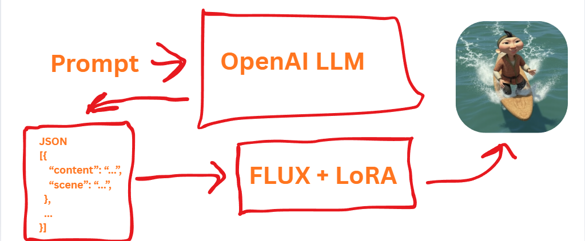
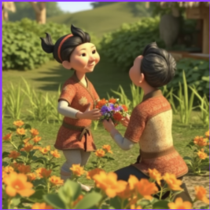
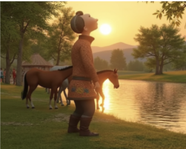

# hacknu-aldarkose-storyboard
## FLUX.1-dev + LoRA training with ai-toolkit
## Simple architecture



Notebook project that:
1) generates a 6-10 card storyboard about Aldar Kose (JSON) from a single text prompt,
2) renders each card into an image using FLUX.1 with a custom LoRA,
3) stores storyboard + PNG frames in a local SQLite database (`storyboards.db`),
4) optionally interpolates frames into a video (`out.mp4`).
## Example
Prompt:Aldar Kose fell in love but got rejected and accepted it




## Other results



## Requirements

- Python 3.11+
- GPU recommended (FLUX is very slow on CPU)
- OpenAI API key (storyboard JSON generation)
- Hugging Face token may be required to download `black-forest-labs/FLUX.1-dev`

## Quickstart (PowerShell)

```powershell
python -m venv .venv
.\.venv\Scripts\Activate.ps1
pip install -U pip
pip install torch diffusers transformers accelerate hf_transfer protobuf sentencepiece openai pillow matplotlib opencv-python tqdm python-dotenv

```powershell
pip install rife-ncnn-vulkan-python
```

## Run the storyboard notebook

1. Open `Main.ipynb` in Jupyter/VS Code and run cells top-to-bottom.
2. Configure variables:
   - `OPENAI_API_KEY` (recommended), or edit the notebook where it does `OpenAI(api_key="")`.
   - If FLUX download is gated, set `HF_TOKEN` / `HUGGINGFACE_HUB_TOKEN`.
3. Set the LoRA weights path:
   - In `Main.ipynb`, update `LOCAL_LORA_PATH` to your `.safetensors` file.
   - Note: the current default in the notebook points at `./workspace/ai-toolkit/output/aldar.safetensors` which may not exist in this repo layout.
4. Enter a prompt; the notebook:
   - calls the LLM to produce `{"storyboard": [...]}` JSON,
   - renders each card's `scene` with FLUX into a 512x512 image,
   - saves images (as PNG BLOBs) + metadata into `storyboards.db`.

